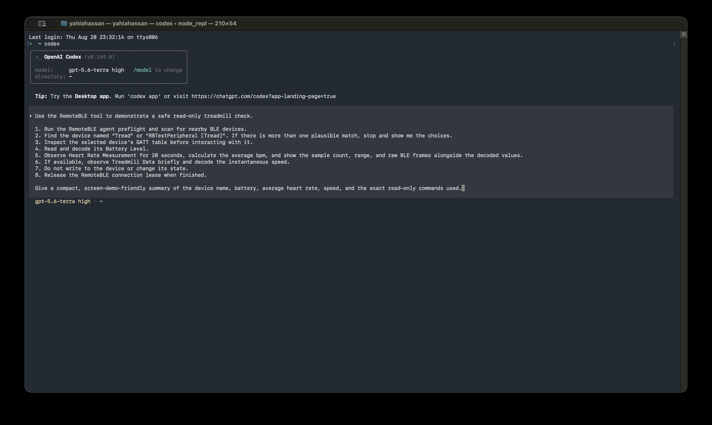

# RemoteBLE Tools

A command-line client and companion Agent Skill for
[RemoteBLE](https://github.com/Yahia-Mohammad/remote-ble).

Primary executable: `remoteble` (optional short alias `rble`).

> Control and debug BLE devices anywhere using commands, pipes, and AI coding agents.

## Demo

[](docs/assets/remoteble-treadmill-demo.mov)

Watch the [full read-only treadmill-check demo](docs/assets/remoteble-treadmill-demo.mov)
(1 min 58 sec, H.264 MOV, 76 MB). The recording shows agent preflight, device discovery,
GATT inspection, Battery Level and Heart Rate reads, a short Treadmill Data observation, and
lease release—without sending a device write.

## What this is

A CLI that turns the RemoteBLE SDK into a general-purpose developer tool, exposing the remote BLE
control plane independently of Kable application code, in any environment able to run a command.

```text
Human / script / CI / coding agent
              │ commands
        remoteble CLI          parsing · output · advisory policy
              │
      slim protocol client
              │ WebSocket + CBOR
       RemoteBLE agent         auth · leases · reconciliation · radio
              │
          BLE device
```

The defining property is that the command may run anywhere while the radio runs beside the
physical device:

```text
Local BLE CLI:      command → local adapter → device
RemoteBLE CLI:      command → network → chosen RemoteBLE agent → device
```

That enables remote labs, phones as radio nodes, CI access from radio-less runners, shared-device
leasing, and simulation.

A companion Agent Skill adds procedural knowledge for coding agents without making AI part of the
core product. The CLI is independently useful, testable, and scriptable.

## Build and run

Build a self-contained native executable on Apple Silicon:

```sh
./gradlew :cli:macosArm64ReleaseArtifacts
cli/build/native-release-stage/macosArm64/dist/bin/remoteble --help
```

That stages the same layout a release archive ships, so the binary is named `remoteble` rather
than carrying Kotlin/Native's `.kexe` linker suffix. `:cli:linkRemotebleReleaseExecutableMacosArm64`
links the executable alone, under `cli/build/bin/`, if that is all you need.

The same Kotlin Multiplatform source also links Linux x64 and ARM64 executables with
`:cli:linkRemotebleReleaseExecutableLinuxX64` and
`:cli:linkRemotebleReleaseExecutableLinuxArm64`. `:cli:fatJar` provides a JVM compatibility
artifact; the native executable is the primary distribution and requires no installed JRE.

Release archives include a manual page in `dist/man/remoteble.1` and Bash, Fish, and Zsh completion
assets in `dist/completions/`.

Every archive also includes the human-readable Agent Skill at `dist/skills/remoteble`. Install the
embedded copy without MCP or credentials with `remoteble skills install`; use
`remoteble skills doctor` to verify installed copies.

The distribution also includes `rble`, a short launcher alias. Use [examples/config.yaml](examples/config.yaml)
as a starting configuration and set the agent token in its configured environment variable.
Configuration precedence is command-line options, selected profile, configuration file, then built-in defaults.

## Install a release

Stable releases publish native packages for Linux and a macOS Apple Silicon Homebrew formula. Replace
`X.Y.Z` with the release version when downloading a package directly from the GitHub Release.

```sh
brew install Yahia-Mohammad/tap/remoteble
sudo apt install ./remoteble_X.Y.Z_amd64.deb
sudo dnf install ./remoteble-X.Y.Z-1.x86_64.rpm
```

Each GitHub Release includes ZIP distributions, the standalone Agent Skill, Linux packages, per-file
checksums in `checksums.txt`, and SBOMs within the distributions. Verify the checksum file before
installing a downloaded artifact. Every archive and package also carries a build provenance
attestation, so a download can be checked against the workflow that produced it:

```sh
gh attestation verify remoteble-macos-arm64-X.Y.Z.zip --repo Yahia-Mohammad/remote-ble-tools
```

### Install an agent

The CLI drives a [RemoteBLE agent](https://github.com/Yahia-Mohammad/remote-ble); it does nothing
on its own. The agent usually runs beside the device rather than beside the CLI, but on macOS the
same tap installs one locally:

```sh
brew trust --cask Yahia-Mohammad/tap/remoteble-agent
brew install --cask remoteble-agent
open -a RemoteBleAgentRs --args --port 8080
```

It installs as a cask, not a formula, because macOS grants Bluetooth to an application bundle and
honors the grant only for an app LaunchServices started — `open` is what satisfies that, and the
first launch prompts once for Bluetooth access. Homebrew also refuses casks from a third-party tap
until it is trusted, which is what the `brew trust` line is for; formulae need no such step. The
build is ad-hoc signed, so the prompt returns after an upgrade.

## Release automation

Pushing a stable `vX.Y.Z` tag builds and publishes the GitHub Release, the Linux packages, signed
build provenance/SBOM attestations, and the Homebrew formula. A valid prerelease tag such as
`vX.Y.Z-rc.1` publishes only the existing ZIP assets as a GitHub prerelease.

The formula is published to [`Yahia-Mohammad/homebrew-tap`](https://github.com/Yahia-Mohammad/homebrew-tap),
using the `HOMEBREW_TAP_REPOSITORY` repository variable and a `HOMEBREW_TAP_TOKEN` secret held in the
`release` environment. The workflow validates packages and the formula on pull requests and `main`,
but does not publish from those events. Deferred packaging work is recorded in
[`docs/distribution-roadmap.md`](docs/distribution-roadmap.md).

Structured output uses the versioned [result envelope schema](schemas/result-envelope-v1.json) and the
[persistent session schemas](schemas/session-input-v1.json). Use `remoteble session --jsonl` for coding
agents; use `remoteble shell` for a human REPL. The shell supports foreground/background streams and
process-level pipes, but is not an OS shell and does not execute child processes. Human-readable data
goes to stdout; diagnostics go to stderr.

## Documents

| Document | What it covers |
|---|---|
| [`docs/state-model.md`](docs/state-model.md) | **Read first.** How connections and leases survive between CLI invocations |
| [`docs/cli-reference.md`](docs/cli-reference.md) | Command surface, output contract, exit codes, configuration |
| [`docs/safety-model.md`](docs/safety-model.md) | Write policy, where enforcement actually lives, untrusted device data, audit |
| [`CONTRIBUTING.md`](CONTRIBUTING.md) / [`SECURITY.md`](SECURITY.md) | Contribution checks and vulnerability reporting policy |
| [`docs/slim-client.md`](docs/slim-client.md) | Embedded protocol/WebSocket/CBOR client boundary and update rules |
| [`docs/session-protocol.md`](docs/session-protocol.md) | Persistent machine session and human shell protocol |
| [`docs/logging-audit.md`](docs/logging-audit.md) | Redacted audit/debug logging, retention, and failure policy |
| [`docs/releasing.md`](docs/releasing.md) | How to cut a release: version files that must agree, tag patterns, and what to check afterwards |
| [`docs/distribution-roadmap.md`](docs/distribution-roadmap.md) | Deferred packaging work: cask automation, apt/yum hosting, Developer ID signing |

## Repository layout

```text
remoteble-tools/
├── core/        high-level, interface-independent operations
├── cli/         commands, formatting, configuration
├── skills/      portable Agent Skills
├── schemas/     versioned output and recipe schemas
├── examples/    configuration examples
├── docs/
└── integration-tests/
```

`core` implements the shared operation layer for the CLI, including BLE lifecycle behavior.
